# Implementation Progress

## Plan Overview

zensql — a Telegram-fronted agent that converts natural language into MariaDB-compatible SQL **text only** (never executed). Built on Python + uv, with FastAPI for the SQL agent server, aiogram for the bot, two Python MCP servers (schema metadata via Metabase, repository/business context via `tirth8205/code-review-graph`), and Claude Code as the orchestrating coding agent. Full plan: [`PLAN.md`](./PLAN.md).

## Chunks

- [x] [1] Project skeleton — pyproject.toml, uv lock, package tree, lint/type/test config
- [x] [2] Configuration & settings — pydantic-settings, env loading, allowlist validation
- [x] [3] SQL agent server API — FastAPI app, /v1/sql/generate stub, /health, /ready
- [x] [4] Telegram bot stub — aiogram handler, AgentClient, echo-through-server flow
- [x] [5] Schema MCP skeleton — stdio MCP server, three tools w/ fixture responses
- [x] [6] Repo registry skeleton — JSON registry of repos w/ per-env connection sources (mirrors debb)
- [x] [7] Code-review-graph integration — register upstream MCP + mirror registry to `~/.code-review-graph/registry.json`
- [x] [8] Metabase API client — `/api/session` auth, `/api/dataset` queries, info_schema chokepoint
- [x] [9] Metadata normalization — queries.py + normalizer.py; schema_mcp consults registry not env
- [x] [10] Claude skills — three SKILL.md files under `.claude/skills/`
- [x] [11] SQL generation orchestration — orchestrator, prompts, AgentRunner
- [x] [12] Safety validation — sqlglot validator, denied-family matrix, banner injection
- [x] [13] Audit logging — JSONL emitter w/ redaction, wired across components
- [x] [14] Local development guide — README sections, troubleshooting
- [x] [15] Final acceptance verification — §17 checklist + sign-off doc

> **Design evolution (after Chunk 5):** Adopted the [debb](../../debb) registry pattern. Each registered repo carries per-environment `connection[].sources[]` blocks (metabase/quickwit/prometheus). The Metabase `database_id` allowlist moves from env (`METABASE_ALLOWED_DATABASE_IDS`) into registry entries. `code-review-graph` is consumed as the upstream PyPI/MCP — no in-house wrapper. Chunk order was reshuffled so the registry lands before the Metabase client. §18 Q1 (code-review-graph distribution) and Q3 (auth = username/password) resolved.

---

## Chunk 1: Project Skeleton

**Status:** ✅ Complete
**Files changed:**
- `pyproject.toml` (created) — project metadata, runtime + dev deps, ruff/mypy/pytest config
- `.gitignore`, `.env.example`, `.mcp.json`, `.claude/settings.json` (created) — config stubs
- `zen/__init__.py` + 7 subpackage `__init__.py` (created) — `sql_agent_server`, `mcp_tools`, `schema_mcp`, `code_graph`, `telegram_bot`, `config`, `models`
- `tests/{,unit/,integration/,e2e/}__init__.py`, `tests/conftest.py` (created)
- `uv.lock` (generated by `uv sync`)

### What changed
Bootstrapped an empty but importable Python project managed by `uv`, with all runtime dependencies pinned (`fastapi`, `aiogram`, `mcp`, `sqlglot`, `httpx`, `pydantic-settings`, etc.) and dev tooling configured (`ruff`, `mypy`, `pytest`). The seven `zen/` subpackages mirror the layout in PLAN §4 so subsequent chunks can drop modules in without restructuring. `.mcp.json` is a stub; servers register in Chunks 5 and 9.

### Before
Before: nothing (only `CLAUDE.md` and pre-existing `docs/` reference material existed).

### After

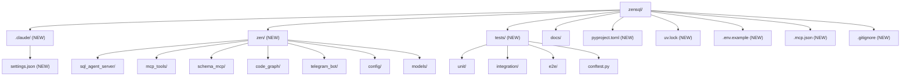

### Verification
- `uv sync` — installed `zensql==0.1.0` editable + full dep tree.
- `uv run pytest -q` — exit 0, no tests collected.
- `uv run ruff check .` — exit 0, clean.

---

## Chunk 2: Configuration and Settings

**Status:** ✅ Complete
**Files changed:**
- `zen/config/settings.py` (created) — `Settings(BaseSettings)`, `StatementFamily` enum, `get_settings()` cached accessor
- `tests/unit/test_settings.py` (created) — 7 unit tests

### What changed
Centralized typed configuration loaded from process env / `.env`. Every component (bot, server, MCP servers) reads its config through `get_settings()`. Secrets (`telegram_bot_token`, `agent_api_token`, Metabase creds) use `SecretStr` so they never appear in `repr()` or default logs. Three list fields (`allowed_statement_families`, `metabase_allowed_database_ids`, `code_graph_allowed_roots`) accept comma-separated env strings via `@field_validator(mode="before")` plus the `NoDecode` annotation (needed because pydantic-settings otherwise tries JSON-decoding the raw env value before validators run). Numeric fields are bounded (`agent_api_port: 1–65535`, `telegram_max_input_chars: 1–4096`, etc.) so misconfigured deploys fail at startup, not deep in a request.

The `StatementFamily` enum starts with `SELECT` only; Chunk 11 (safety validator) extends it as needed and is the only other code that consumes it.

### Before

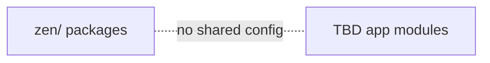

### After

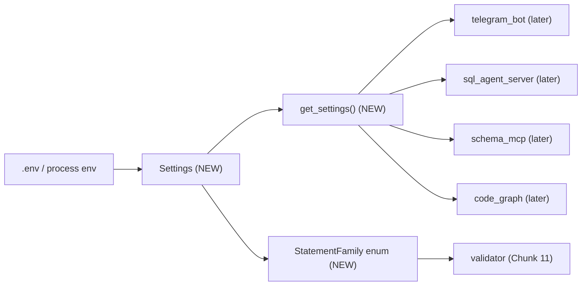

### Verification
- `uv run pytest tests/unit/test_settings.py -q` — **7 passed in 0.09s**.
- `uv run ruff check zen tests` — clean.
- Tests cover: defaults, comma-separated `int`/`str`/enum list parsing, unknown enum rejection, out-of-range port, `SecretStr` redaction in `repr()`.

---

## Chunk 3: SQL Agent Server API

**Status:** ✅ Complete
**Files changed:**
- `zen/models/requests.py` (created) — `UserSqlRequest`, `ContextHints` (`extra="forbid"`, length-bounded text 1–8000).
- `zen/models/responses.py` (created) — `GeneratedSqlResponse` (sql/error_code mutually populated by orchestrator; both currently optional).
- `zen/sql_agent_server/deps.py` (created) — `get_settings_dep()`, `verify_bearer()` using `secrets.compare_digest` for constant-time token comparison.
- `zen/sql_agent_server/routes_health.py` (created) — `GET /health`, `GET /ready`.
- `zen/sql_agent_server/routes_generate.py` (created) — `POST /v1/sql/generate` stub returning banner-prefixed `SELECT 1 AS placeholder;`.
- `zen/sql_agent_server/app.py` (created) — `create_app()` factory, wires routers; `app` instance for `uvicorn zen.sql_agent_server.app:app`.
- `tests/integration/test_agent_server_api.py` (created) — 11 TestClient integration tests.

### What changed
The HTTP surface the Telegram bot will call is now real, even though the body it returns is a stub. The endpoint:
- Validates bearer token via a FastAPI `Depends(verify_bearer)` (401 on missing, wrong scheme, or wrong token).
- Validates the body with `UserSqlRequest` (422 on missing fields, oversize text, empty text, wrong source enum, extra fields).
- Returns a `GeneratedSqlResponse` whose `sql` field is prefixed with the §10.7 audit banner so the bot can immediately format the response correctly. Chunk 10 swaps the stub body for the real orchestrator output without changing the response schema.

Auth uses `secrets.compare_digest` on UTF-8 bytes so token comparisons don't leak length info. Tests use FastAPI's `dependency_overrides` on `get_settings_dep` to inject a known token, bypassing env coupling.

### Before

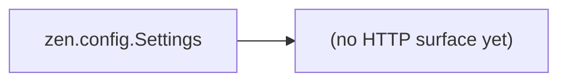

### After

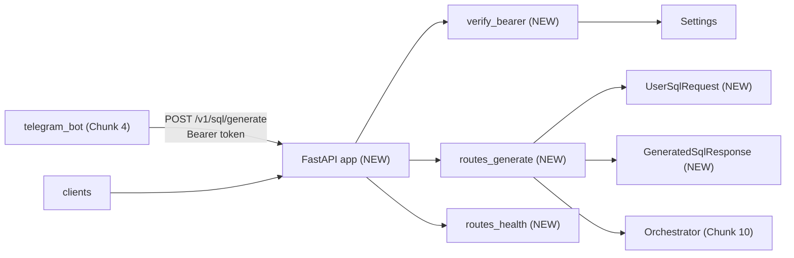

### Data / Logic Flow

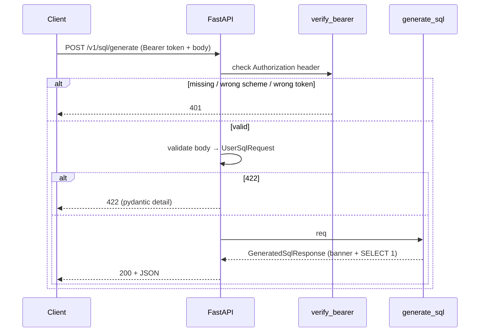

### Verification
- `uv run pytest tests/ -q` — **18 passed in 0.42s** (7 from Chunk 2 + 11 from Chunk 3).
- `uv run ruff check zen tests` — clean.
- Tests cover: `/health` 200, `/ready` 200, happy path generate (banner present, request_id round-trips), missing token, wrong token, non-bearer scheme, missing fields, oversize text, empty text, wrong source enum, extra-field rejection.

---

## Chunk 4: Telegram Bot Stub

**Status:** ✅ Complete
**Files changed:**
- `zen/telegram_bot/client.py` (created) — `AgentClient` (httpx async POST with bearer auth, 65s timeout) + `AgentClientProtocol` for DI.
- `zen/telegram_bot/handlers.py` (created) — `format_reply(resp)` (HTML escape + `<pre><code class="language-sql">` + warning) and pure async `process_message(text, user_id, settings, client)` decoupled from aiogram.
- `zen/telegram_bot/bot.py` (created) — `Bot`/`Dispatcher` bootstrap with `/start` greeting and catch-all text handler; `python -m zen.telegram_bot.bot` entry.
- `tests/unit/test_telegram_handler.py` (created) — 9 tests using a `FakeAgentClient`.
- `tests/unit/test_agent_client.py` (created) — 5 `respx`-mocked tests.

### What changed
The Telegram surface is real but unconnected to a live bot — the orchestration logic is pure-async and unit-tested with a fake client. `process_message` truncates incoming text to `settings.telegram_max_input_chars`, strips whitespace, refuses empty input, builds a `UserSqlRequest` with a fresh `request_id`, calls the server, and formats the reply. HTTP failures surface to the user as either `"Upstream rejected the request (NNN)"` or `"Upstream error: <ExceptionClass>"` — no stack traces leak. The reply uses HTML mode with `html.escape` over the SQL body so `<`, `>`, `&` from user-generated SQL never break parsing.

`AgentClientProtocol` makes the handler depend on a Protocol, not the concrete `AgentClient`. Tests substitute `FakeAgentClient`; production code uses the httpx-backed implementation. The bot bootstrap is intentionally minimal — long-poll loop, no webhook, no DI for the client (created per message; revisit when audit logging lands in Chunk 12).

### Before

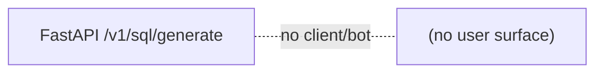

### After

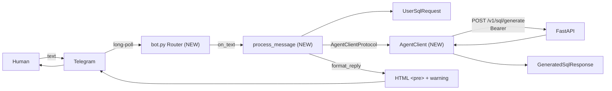

### Verification
- `uv run pytest tests/ -q` — **32 passed in 0.31s** (was 18; added 14).
- `uv run ruff check zen tests` — clean (after dropping one unused `pytest` import).
- Tests cover: `format_reply` markup + HTML escaping; `process_message` happy path, truncation, whitespace-only rejection, empty rejection, `HTTPStatusError`/`ConnectError` surfacing; `AgentClient` happy path, trailing-slash base URL normalization, 401/503 raise, transport-error propagation, bearer header set correctly.

---

## Chunk 5: Schema MCP Skeleton

**Status:** ✅ Complete
**Files changed:**
- `zen/mcp_tools/errors.py` (created) — `McpToolError` base + 8 typed subclasses (`DatabaseNotAllowedError`, `WriteAttemptError`, `PathNotAllowedError`, etc.) shared by both MCP servers.
- `zen/schema_mcp/tools.py` (created) — `get_table_metadata`, `search_tables`, `get_relationships` async functions. Hardcoded `orders` + `customers` fixtures so the MCP contract is testable end-to-end. `_assert_database_allowed` enforces `metabase_allowed_database_ids`.
- `zen/schema_mcp/server.py` (created) — `FastMCP("schema")` instance with `@mcp.tool()` registrations and a `main()` entrypoint that runs stdio transport. Launched per-request by Claude Code via `.mcp.json`.
- `.mcp.json` (updated) — registered `schema` server pointing at `uv run python -m zen.schema_mcp.server`.
- `tests/integration/test_schema_mcp.py` (created) — 13 tests: 11 direct function tests (happy path, include flags, schema/table filtering, allowlist rejection, search substring, max_results, empty query) + 2 in-memory MCP roundtrip tests (`list_tools`, `call_tool`) that verify FastMCP registration + JSON schema generation.

### What changed
The metadata path is now reachable through MCP — a Claude Code session pointed at this project will see three tools (`mcp__schema__get_table_metadata`, `mcp__schema__search_tables`, `mcp__schema__get_relationships`) and can invoke them. The responses use hardcoded fixtures shaped exactly like the final §7 contract, so downstream chunks (Claude skills, orchestrator) can integrate against the stable shape without depending on Metabase being reachable. The `_assert_database_allowed` chokepoint is wired up now so Chunk 6/7 don't have to bolt it on later — every tool already refuses unknown `database_id` values.

Errors raised from tool functions surface as MCP error responses. Typed exception codes (`DATABASE_NOT_ALLOWED`, `WRITE_NOT_ALLOWED`, ...) live in one place so future tools (code_graph) reuse them.

### Before

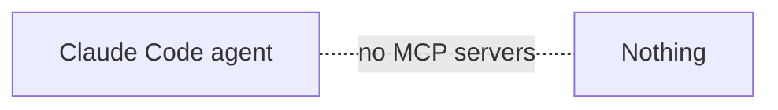

### After

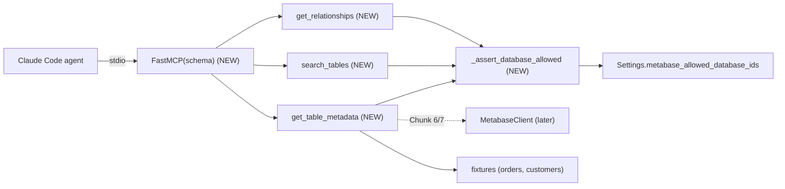

### Verification
- `uv run pytest tests/ -q` — **45 passed in 0.46s** (was 32; added 13).
- `uv run ruff check zen tests` — clean.
- Tests cover: fixture shape per `include_*` flags, schema/table filtering, unknown-table empty result, `DATABASE_NOT_ALLOWED` rejection on each tool, search substring match, search max_results cap, FK return for `orders→customers`, FastMCP `list_tools` reports exactly 3, FastMCP `call_tool("get_table_metadata", ...)` returns the structured payload.

---

## Chunk 6: Repo Registry Skeleton

**Status:** ✅ Complete
**Files changed:**
- `zen/registry/__init__.py` (created) — public exports.
- `zen/registry/models.py` (created) — `RepoEntry`, `ConnectionBlock`, discriminated-union `Source` (`MetabaseSource`/`QuickwitSource`/`PrometheusSource`) + typed `*Metadata` models. Validation mirrors debb's `registry_entry.schema.json` + `source_*.schema.json`.
- `zen/registry/store.py` (created) — `RegistryStore(path)` with atomic `tempfile`+`os.replace` save, `RegistryDocument` envelope (`version: 1`, `repos: []`), CRUD (`register`/`get`/`list_repos`/`update`/`delete`), typed `DuplicateRepoError` + `RepoNotFoundError`.
- `zen/config/settings.py` (updated) — added `registry_path` (default `.claude/skills/sql_add_repo/registry.json`); fixed `code_graph_registry_path` default to upstream's actual location `~/.code-review-graph/registry.json`.
- `.env.example` (updated) — new `REGISTRY_PATH`; clarified `CODE_GRAPH_REGISTRY_PATH` is upstream's path.
- `tests/unit/test_registry_store.py` (created) — 19 tests.
- `tests/unit/test_settings.py` (updated) — covers the new `registry_path` default.

### What changed
zensql now owns a registry that mirrors debb's shape: each repo declares `connection[].environment` blocks, each with zero+ `sources[]` of type `metabase`/`quickwit`/`prometheus`. The Pydantic models enforce the same constraints as debb's JSON Schemas (name pattern, absolute path, ≥1 tag, ≥1 connection, Metabase `database_id≥1`, valid engine enum). The discriminator on `Source.name` makes invalid source types fail at parse time. `RepoEntry.metabase_sources(environment=None)` is a helper future chunks (Schema MCP, orchestrator) will use to translate a repo selection into legal `database_id` values.

Atomic save (`tempfile` → `os.replace`) means a crashed write leaves the existing registry intact rather than truncating it. By using `by_alias=True` on dump, the Pydantic `schema_` field round-trips as JSON `"schema"` so registrations stay interchangeable with debb's `registry.json`.

This chunk replaces the env-based Metabase allowlist (`METABASE_ALLOWED_DATABASE_IDS`) as the source of truth — Chunk 9 wires Schema MCP to consult the registry; Chunk 7 mirrors entries into the upstream `code-review-graph` registry.

### Before

```mermaid
graph LR
  S["Settings.metabase_allowed_database_ids (env)"] --> MCP["schema_mcp tools (Chunk 5)"]
  Nothing["no repo concept"] -. .- MCP
```

### After

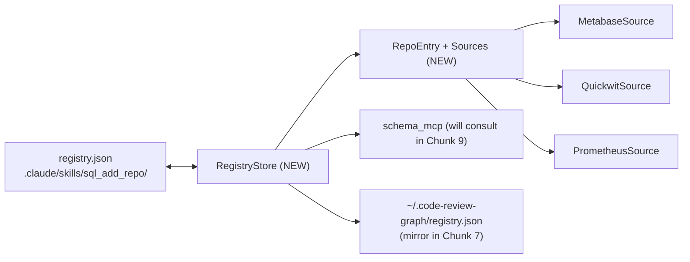

### Verification
- `uv run pytest tests/ -q` — **65 passed in 0.48s** (was 45; added 20: 19 new registry + 1 settings).
- `uv run ruff check zen tests` — clean (after `contextlib.suppress` and merged `if`).
- Tests cover: round-trip with `schema` alias preserved, name-pattern rejection, relative-path rejection, empty-tags rejection, unknown DB engine rejection, `database_id=0` rejection, discriminator picks correct subclass, unknown source name rejected, `metabase_sources()` per-environment filtering, empty load when file absent, atomic write leaves no leftover tempfiles, duplicate-name rejection on register, list/get round-trip, update merge preserves untouched fields, rename when target free, rename collision rejection, missing-on-update raise, delete, missing-on-delete raise.

---

## Chunk 7: Code-review-graph Integration

**Status:** ✅ Complete
**Files changed:**
- `pyproject.toml` (updated) — added `code-review-graph>=2.3.2` runtime dep.
- `.mcp.json` (updated) — registered upstream `code-review-graph` MCP server (`uv run code-review-graph serve`).
- `zen/code_graph/__init__.py` (created) — public exports.
- `zen/code_graph/crg_sync.py` (created) — `sync_register`, `sync_unregister`, `sync_build` subprocess wrappers around the CRG CLI. Stable `CrgSyncResult` TypedDict shape. Graceful skip when CLI not on PATH. Timeouts: 30s for register/unregister, 600s for build.
- `tests/unit/test_crg_sync.py` (created) — 11 tests, all mock `shutil.which` + `subprocess.run`.

### What changed
zensql now depends on the upstream `code-review-graph` package and exposes its MCP server alongside our own `schema` server. A Claude Code session in this project sees `mcp__schema__*` tools (ours) and `mcp__code-review-graph__*` tools (theirs — `semantic_search_nodes`, `query_graph`, etc.) without us writing any wrapper.

The `crg_sync` helpers let the skill (Chunk 10) keep zensql's registry in lock-step with `~/.code-review-graph/registry.json`. Deliberate omissions vs. debb:
- **No `install`** — debb runs `code-review-graph install -y` to inject MCP config + CLAUDE.md instructions into the registered repo. zensql treats registered repos as read-only context; modifying them would surprise the user.
- **No auto-build on register** — the skill orchestrates `register → build` explicitly so the agent can warn before a multi-minute parse.

Subprocess failures (non-zero exit, timeout, OSError) surface as `{"ran": True, "ok": False, ...}`. The CLI not being on PATH surfaces as `{"ran": False, "skipped_reason": ...}`. Two states, never an unhandled exception.

### Before

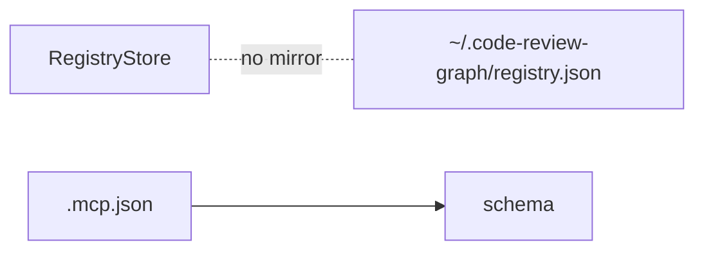

### After

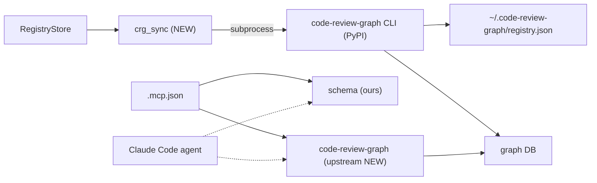

### Verification
- `uv run pytest tests/ -q` — **76 passed in 0.54s** (was 65; added 11).
- `uv run ruff check zen tests` — clean.
- `uv run code-review-graph --help` — confirms `register`, `unregister`, `build`, `serve` subcommands.
- Tests cover: register/unregister/build issue exact CLI command with correct flags & timeouts; explicit `skip=True` short-circuits without subprocess; missing CLI surfaces skipped-reason without raising; non-zero exit captured; `TimeoutExpired` and `OSError` converted to structured failure; default build timeout 600s.

---

## Chunk 8: Metabase API Client

**Status:** ✅ Complete
**Files changed:**
- `zen/schema_mcp/metabase_client.py` (created) — `MetabaseClient` async context manager + `_assert_information_schema_only` chokepoint.
- `tests/unit/test_metabase_client.py` (created) — 33 tests covering chokepoint + auth + dataset path + retries + timeouts.

### What changed
The schema MCP now has a real HTTP path to Metabase. The client:
- Lazily logs in with username/password (`POST /api/session`) → caches session id → uses `X-Metabase-Session` header.
- Auto-refreshes the session once on 401 (single retry to handle stale sessions); a second 401 raises `MetabaseAuthFailedError`.
- Retries 5xx up to 3 attempts with exponential backoff (0.5/1.0/2.0s).
- Converts `httpx.TimeoutException` → `UpstreamTimeoutError` so callers see typed failures instead of httpx internals.
- `list_databases()` handles both legacy `[...]` and Metabase v0.50+ `{"data": [...]}` shapes.

The critical safety surface is `_assert_information_schema_only`. It runs **before** any HTTP request and uses sqlglot (dialect `mysql`, which covers MariaDB) to:
1. Reject empty SQL.
2. Reject unparseable SQL.
3. Reject multi-statement input.
4. Require the top-level expression to be `exp.Select` — INSERT/UPDATE/DELETE/DROP/TRUNCATE/ALTER/CREATE/`UNION` all fail this check.
5. Walk every `exp.Table` (including subqueries) and reject any that isn't in `information_schema.<table>`.
6. Restrict the `<table>` to a hardcoded allowlist: `{columns, statistics, partitions, key_column_usage, referential_constraints, tables}`.
7. Require at least one table reference (`SELECT 1` is refused).

This means the dataset endpoint is **physically unable** to forward a write or a non-metadata SELECT.

### Before

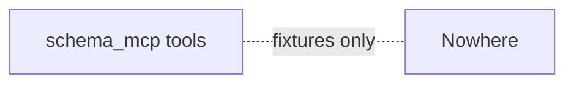

### After

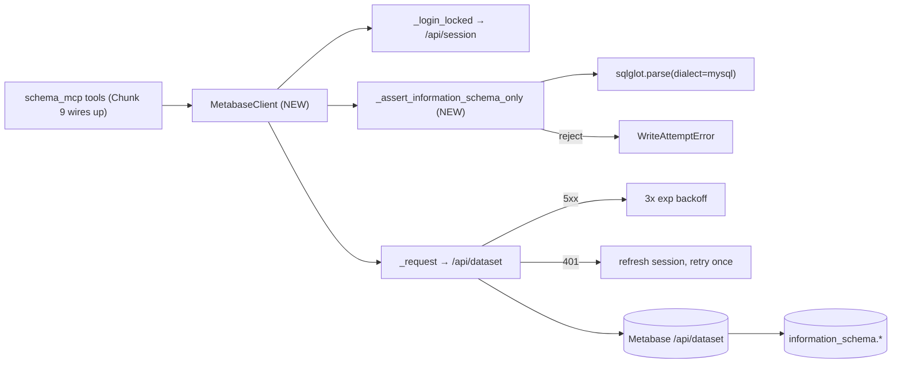

### Verification
- `uv run pytest tests/ -q` — **109 passed in 0.64s** (was 76; added 33).
- `uv run ruff check zen tests` — clean.
- Chokepoint covers: 4 allowed shapes, empty, unparseable, multi-statement, 7 non-SELECT families, non-info_schema table, info_schema table outside allowlist, sneaky subquery, UNION to outside, table-less SELECT.
- HTTP client covers: session happy/401/403/missing-id, list_databases legacy & v0.50 shapes, dataset happy body shape, template params, 401 → refresh → succeed, 401 → refresh → still-401 → auth error, 503 retry then succeed, 503 exhaustion, connect-timeout → `UpstreamTimeoutError`.

---

## Chunk 9: Metadata Normalization

**Status:** ✅ Complete
**Files changed:**
- `zen/models/metadata.py` (created) — `TableMetadata`, `ColumnMetadata`, `IndexMetadata`, `PartitionMetadata`, `Relationship`. Identifier fields regex-validated against `^[A-Za-z0-9_]+$`.
- `zen/schema_mcp/queries.py` (created) — `build_columns_query`, `build_indexes_query`, `build_partitions_query`, `build_relationships_query`, `build_search_query`. Identifier inputs validated, LIKE pattern escaped.
- `zen/schema_mcp/normalizer.py` (created) — `normalize_columns/indexes/partitions/relationships(rows)` returning dicts keyed by `(schema, table)`. Aggregates multi-column indexes by `(schema, table, index_name)`. `_extract_rows()` helper for Metabase envelope.
- `zen/schema_mcp/tools.py` (rewritten) — calls real `MetabaseClient` + normalizer; replaced env-based `_assert_database_allowed` with a registry-driven version (union of all `metabase_sources()` `database_id`s); empty registry → reject all.
- `zen/schema_mcp/server.py` (rewritten) — lazy singletons `_get_client()`, `_get_registry()` injected into tool calls.
- `pyproject.toml` (updated) — added `E501` to test-files ignore (fixture rows naturally wide).
- `tests/unit/test_queries.py` (created) — 13 tests on template builders.
- `tests/unit/test_normalizer.py` (created) — 7 tests on normalization.
- `tests/integration/test_schema_mcp.py` (rewritten) — 7 tests via injected `FakeMetabaseClient` + `RegistryStore`.

### What changed
The Schema MCP is now end-to-end real (modulo the Metabase HTTP boundary): tools receive an injectable `client` + `registry`, validate `database_id` against the registry, build info_schema SQL via `queries.py`, submit through `MetabaseClient` (which re-runs the chokepoint), then normalize the raw rows into typed Pydantic models. Tool responses still match the §7 envelope so downstream agents see the same shape they always have.

Two notable safety properties:
1. **No wide-open WHERE.** `_in_list_sql([])` returns `(NULL)`, matching nothing. So a query with empty schema/table lists never silently scans the whole `information_schema`.
2. **Empty registry → deny.** A fresh deployment with no registered repos rejects every tool call with a clear actionable error (`"register one with sql_add_repo"`). The skill in Chunk 10 picks this up as a UX hook.

The Pydantic identifier validation in `metadata.py` catches any normalization error that would produce a malformed identifier in tool output — defense-in-depth against a future schema-source returning garbage rows.

### Before

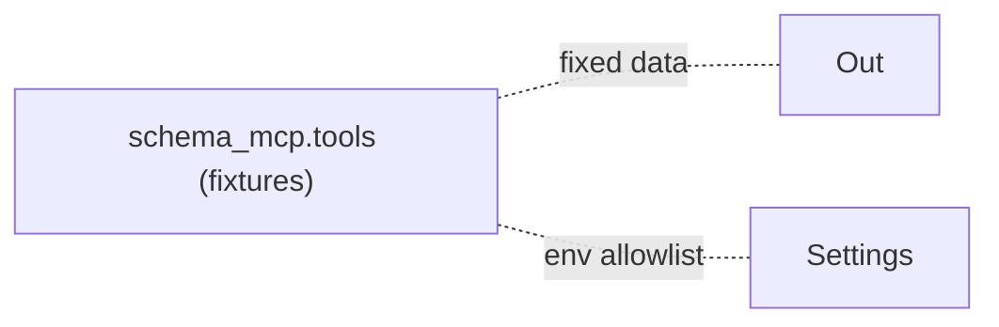

### After

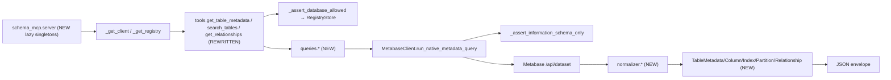

### Verification
- `uv run pytest tests/ -q` — **129 passed in 0.49s** (was 109; added 20: 13 queries + 7 normalizer; rewrote 13 integration tests).
- `uv run ruff check zen tests` — clean.
- Coverage adds: identifier regex rejects `;`, spaces, comments, dotted refs; `IN (NULL)` for empty lists; LIKE escape for `%/_/\\/'`; oversize/empty/bad-limit search rejected; nullable=`YES/NO/bool` coerced; compound index aggregation preserves column order; envelope extraction tolerates missing `data`; registry-empty rejection; registry mismatch rejection; happy-path columns-only, all-includes; FK extraction; substring search returns matches.

---

## Chunk 10: Claude Skills

**Status:** ✅ Complete
**Files changed:**
- `.claude/skills/sql_get_table/SKILL.md` (created) — workflow for `mcp__schema__*` tool calls; explicit registry-first DB-resolution step.
- `.claude/skills/sql_add_repo/SKILL.md` (created) — interactive registry CRUD pattern (mirrors debb's debug-repo). Routes all mutations through `uv run python -m zen.registry.cli`. Documents `--no-graph-sync` / `--no-graph-build`.
- `.claude/skills/sql_find_business_context/SKILL.md` (created) — routes to upstream `mcp__code-review-graph__*` tools; cross-references results back into `sql_get_table` for column verification; **explicit prompt-injection warning** treating repo snippets as data not commands.
- `zen/registry/cli.py` (created) — argparse-based CLI: `register`/`list`/`get`/`update`/`delete` subcommands. JSON in stdin, structured JSON out stdout, errors to stderr with stable `{"error", "message"}` shape. Wired to `RegistryStore` + `crg_sync`.
- `tests/unit/test_registry_cli.py` (created) — 14 tests with `_stub_crg` autouse fixture so subprocess calls are mocked at the `crg_sync.*` boundary.

### What changed
Claude Code agents in this project now see three discoverable skills (the agent's `/skills` listing). The natural flow:

1. User asks a SQL question → `sql_get_table` fetches metadata.
2. User mentions an unfamiliar service/term → `sql_find_business_context` searches indexed repos.
3. User says "add my repo" → `sql_add_repo` walks them through the registry entry interactively, then calls the CLI.

The CLI is the **only** mutation path for the registry. It owns:
- Pydantic-level schema validation.
- Atomic save via `RegistryStore` (tempfile + os.replace).
- code-review-graph sync (register/build on add, unregister on delete) with stable result shapes.
- Stable JSON I/O so the skill can parse outputs reliably.

Skills are self-contained instruction sheets — no script under `.claude/skills/sql_add_repo/scripts/` because the canonical CLI is `zen.registry.cli`. This keeps validation logic colocated with the Python tests rather than mirrored across two locations.

### Before

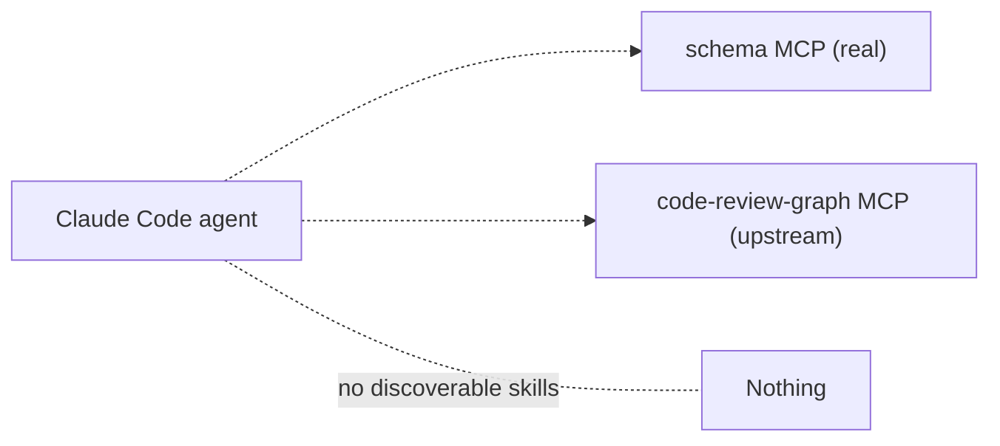

### After

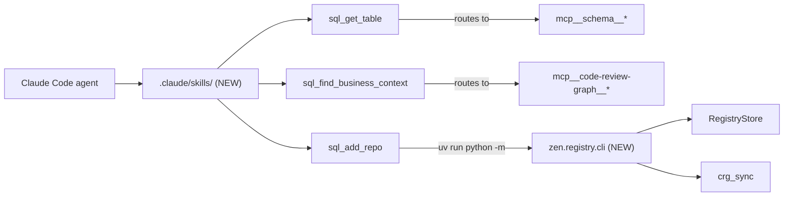

### Verification
- `uv run pytest tests/ -q` — **143 passed in 0.49s** (was 129; added 14 CLI tests).
- `uv run ruff check zen tests` — clean.
- Tests cover: CLI register happy/duplicate/invalid-JSON/schema-error/--no-graph-sync/--no-graph-build, list (registers then lists), get/get-missing, update merge, update-invalid-patch-type, delete + sync_unregister invocation. All CRG calls mocked.
- Skill discovery (manual `claude` run + `/skills`) deferred to Chunk 15.

---

## Chunk 11: SQL Generation Orchestration

**Status:** ✅ Complete
**Files changed:**
- `zen/models/safety.py` (created) — `SafetyViolation` (rule, detail, evidence).
- `zen/sql_agent_server/intent_guard.py` (created) — five categories of regex patterns (`EXECUTE_INTENT`, `WRITE_INTENT`, `PRIV_ESCALATION`, `EXFILTRATION`, `PROMPT_INJECTION`). Bounded-filler regex (`.{0,40}`) so phrases like "show me the .env file" still match.
- `zen/sql_agent_server/prompts.py` (created) — `build_system_prompt()` enforces SQL-text-only contract + reply format; `build_user_prompt()` wraps the raw text in `<user_request>...</user_request>` sentinels to limit prompt-injection scope.
- `zen/sql_agent_server/agent_runner.py` (created) — `AgentRunnerProtocol`, `AgentRunResult` dataclass, `ClaudeCodeRunner` (real `asyncio.create_subprocess_exec` of `claude -p ... --append-system-prompt ... --mcp-config ... --allowedTools ...`), `FakeAgentRunner` for tests with full `.calls` capture.
- `zen/sql_agent_server/orchestrator.py` (created) — `Orchestrator.run(req)` runs pre-guard → invoke runner → handle timeout / non-zero exit → `parse_agent_output` extracts the first ```` ```sql ```` block → prepend banner. Six typed error codes (`UNSAFE_INTENT`, `TIMEOUT`, `AGENT_FAILED`, `NO_SQL_PRODUCED`, plus pass-through to Chunk 12 validator).
- `zen/sql_agent_server/deps.py` (updated) — added `get_orchestrator_dep()` building a `ClaudeCodeRunner` from settings.
- `zen/sql_agent_server/routes_generate.py` (rewritten) — endpoint now delegates entirely to `Orchestrator`. Stub body gone.
- `tests/unit/test_intent_guard.py` (created) — 25 tests across all five categories.
- `tests/unit/test_prompts.py` (created) — 3 tests on prompt scaffolding.
- `tests/unit/test_orchestrator.py` (created) — 11 tests covering parse + happy path + 3 error paths + 4 pre-guard rejections.
- `tests/integration/test_agent_server_api.py` (rewritten) — now overrides `get_orchestrator_dep` with `Orchestrator(settings, FakeAgentRunner(stdout=_STUB_OUTPUT))`. Added unsafe-intent test asserting endpoint returns 200 + `error_code: UNSAFE_INTENT`.

### What changed
The agent server is no longer a stub. A POST to `/v1/sql/generate` now:
1. Goes through pre-guard (≈21 patterns); on match, returns 200 with `error_code: UNSAFE_INTENT` and never spawns Claude.
2. Builds prompts with sentinel-delimited user text.
3. Spawns Claude Code via `AgentRunnerProtocol` (real or fake) with MCP servers wired through `.mcp.json` and an explicit `allowedTools` allowlist covering both `mcp__schema__*` and `mcp__code-review-graph__*`.
4. Imposes a settings-controlled timeout; timeout → `error_code: TIMEOUT` with seconds in message.
5. Parses the first fenced ```` ```sql ```` block; missing block → `error_code: NO_SQL_PRODUCED`.
6. Prepends the §10.7 banner (real validator from Chunk 12 will replace the passthrough).

The orchestrator never imports a DB driver, so the system can still not execute SQL even if asked to.

### Before

```mermaid
graph LR
  Endpoint["POST /v1/sql/generate (stub)"] --> Resp["SELECT 1 AS placeholder"]
```

### After

```mermaid
graph LR
  Endpoint["POST /v1/sql/generate (NEW)"] --> Orch["Orchestrator (NEW)"]
  Orch --> Guard["intent_guard (NEW)"]
  Guard -->|"unsafe"| Err["GeneratedSqlResponse(error_code=UNSAFE_INTENT)"]
  Orch --> Pr["prompts.build_system/user (NEW)"]
  Pr --> Runner["AgentRunnerProtocol (NEW)"]
  Runner -->|"prod"| Claude["ClaudeCodeRunner (NEW)<br/>asyncio subprocess"]
  Runner -->|"test"| Fake["FakeAgentRunner (NEW)"]
  Claude --> CLI["claude -p ... --mcp-config .mcp.json"]
  CLI -.-> MCP1["mcp__schema__*"]
  CLI -.-> MCP2["mcp__code-review-graph__*"]
  Orch --> Parse["parse_agent_output (NEW)"]
  Parse --> Banner["+ AI-GENERATED banner"]
  Banner --> Resp["GeneratedSqlResponse(sql, explanation)"]
```

### Verification
- `uv run pytest tests/ -q` — **185 passed in 0.52s** (was 143; added 42: 25 intent + 3 prompts + 11 orchestrator + 3 new in API integration; existing 7 rewritten).
- `uv run ruff check zen tests` — clean.
- Coverage adds: parse extracts SQL block + post-text, strips inner whitespace, case-insensitive fence, empty-block returns empty; happy-path banner + request_id round-trip; timeout returns TIMEOUT; non-zero exit returns AGENT_FAILED; no-SQL-block returns NO_SQL_PRODUCED; pre-guard short-circuits before runner.calls grow; intent matrix across all 5 categories including the `show me the .env file` edge case.
- Real `ClaudeCodeRunner` is not exercised in tests (deferred to Chunk 15 manual smoke).

---

## Chunk 12: Safety Validation

**Status:** ✅ Complete
**Files changed:**
- `zen/sql_agent_server/validator.py` (created) — `SqlSafetyValidator` + `ValidationReport`. Six-stage pipeline (denylist keyword pre-check → sqlglot parse → single-statement → family check → identifier verification → risk warnings → banner injection).
- `zen/sql_agent_server/orchestrator.py` (updated) — drop hand-rolled banner; instantiate `SqlSafetyValidator` from settings (`allowed_statement_families` + `strict_identifier_check`); on `report.ok == False` return `VALIDATION_FAILED`; otherwise pass `report.sql_with_banner` + `report.tables_referenced` + `report.warnings` through.
- `tests/unit/test_validator.py` (created) — 26 tests.
- `tests/unit/test_orchestrator.py` (updated) — happy-path test now passes a LIMIT'd SQL so non-strict warnings don't accumulate; added `test_orchestrator_validation_failure_returns_error` (DROP from a fake runner → VALIDATION_FAILED).

### What changed
The agent's output is no longer trusted blindly. After the orchestrator extracts the fenced SQL block, it passes the body through `SqlSafetyValidator`:

1. **Comment-stripped keyword denylist** catches `DROP/INSERT/UPDATE/...` even if hidden in a subquery — `SELECT * FROM (DROP TABLE x) AS t` is rejected because the keyword regex runs before parsing. 22 denied keywords.
2. **sqlglot parse** with dialect `mysql`. Unparseable → `UNPARSEABLE`.
3. **Statement count == 1**. `SELECT 1; SELECT 2;` → `MULTI_STATEMENT`.
4. **Family check** maps `exp.Select`/`Insert`/`Update`/etc. to a family string and asserts it's in `allowed_families` (default `{"SELECT"}`, configurable via env).
5. **Identifier verification** against an optional `retrieved_metadata: list[TableMetadata]`. Unknown table or column → `IDENTIFIER_NOT_VERIFIED` (strict) or a warning (non-strict). Cross-table column-qualification is handled by only checking `col.table == name` matches.
6. **Risk warnings**: `SELECT *`, missing `LIMIT`, suspicious functions (`LOAD_FILE`, `SLEEP`, `BENCHMARK`, `OUTFILE`, `GET_LOCK`).
7. **Banner injection**: prepends the §10.7 four-line banner with `request_id` and ISO timestamp; normalizes trailing semicolon.

The orchestrator currently passes `retrieved_metadata=None`, because we don't yet capture metadata from MCP tool invocations during the agent run. Wiring that capture is left to a future enhancement (the validator already accepts the parameter).

### Before

```mermaid
graph LR
  Parse["parse_agent_output"] --> Banner["hand-rolled banner"]
  Banner --> Resp["GeneratedSqlResponse"]
```

### After

```mermaid
graph LR
  Parse["parse_agent_output"] --> Val["SqlSafetyValidator (NEW)"]
  Val --> Deny["denylist keyword regex (NEW)"]
  Val --> SG["sqlglot.parse"]
  Val --> Family["family map → allowed_families"]
  Val --> Ident["identifier check (optional metadata)"]
  Val --> Risk["risk-pattern warnings"]
  Val -->|"ok"| BannerAuto["+ banner + tables_referenced + warnings"]
  Val -->|"violation"| Err["GeneratedSqlResponse(error_code=VALIDATION_FAILED)"]
```

### Verification
- `uv run pytest tests/ -q` — **221 passed in 0.58s** (was 185; added 36: 26 validator + updates to 10 orchestrator/API tests).
- `uv run ruff check zen tests` — clean (after one RET504 cleanup).
- Denied-family matrix: parametrized over 19 SQL samples covering all required PLAN §10.2 families; each rejected with `STATEMENT_FAMILY_DENIED` or `UNPARSEABLE` (sqlglot refuses some malformed dialect samples outright).
- Identifier checks: strict rejects unknown table, strict rejects unknown column (qualified), non-strict warns instead, known table+column passes.
- Risk warnings: SELECT * warns, missing LIMIT warns, SLEEP() warns, LOAD_FILE() warns. `tables_referenced` collects unique join targets in source order.
- End-to-end: orchestrator returns `VALIDATION_FAILED` when the fake agent emits a DROP.

---

## Chunk 13: Audit Logging

**Status:** ✅ Complete
**Files changed:**
- `zen/models/audit.py` (created) — `AuditEvent` with `event_id`/`event_type`/`request_id`/`job_id`/`actor`/`payload_hash`/`created_at`/`severity`/`details`.
- `zen/sql_agent_server/audit.py` (created) — `AuditLogger(log_dir, actor)`, threading-locked JSONL append, daily rotation by UTC date, credential-key sanitizer, `redact_text` + `redact_sql` helpers, `NullAuditLogger` for tests.
- `zen/sql_agent_server/orchestrator.py` (updated) — emits **8 event types** in the happy path + branch points: `request_received`, `unsafe_intent_rejected`, `agent_invocation_started`, `agent_invocation_completed`, `upstream_error` (timeout / non-zero exit / no-SQL-block), `safety_violation`, `sql_generated`.
- `zen/sql_agent_server/deps.py` (updated) — `get_audit_logger_dep()` builds the logger from settings; `get_orchestrator_dep()` now wires it in.
- `tests/unit/test_audit.py` (created) — 8 tests on redaction + I/O + credential stripping + no-raw-leakage invariants.
- `tests/unit/test_orchestrator.py` (updated) — 4 new audit-emission tests: full event sequence on happy path, unsafe-intent short-circuits, safety_violation on DROP, **raw user text never appears in log file**.

### What changed
Every meaningful state transition in the orchestrator now emits a JSON line to `${AUDIT_LOG_DIR}/audit-YYYY-MM-DD.jsonl`. Lines are append-only, one per event, lock-serialised across threads. Two invariants enforced by tests:

1. **No raw user text or SQL in logs.** All free text passes through `redact_text` (returns `{sha256, preview}` where preview is the first 64 chars with non-word chars replaced by `·`). All SQL passes through `redact_sql` (returns `{sha256, length}`). The "telltale string" test plants a unique phrase in the user request and asserts it never appears in the resulting JSONL.
2. **No credentials.** `_strip_credentials` walks the `details` dict (recursively into nested dicts) and replaces values for any key in the credential allowlist (`password`, `token`, `session_token`, `api_key`, `secret`, plus the three project-specific tokens) with `"<redacted>"`. Tested with a payload that nests `api_key` inside another dict.

`payload_hash` is the SHA-256 of the canonical-JSON-serialised (sorted-keys) details. The hash is stable across dict-key reordering (tested), so equivalent payloads from different code paths have matching hashes for log dedup / correlation.

### Before

```mermaid
graph LR
  Orch["Orchestrator"] --> Resp["GeneratedSqlResponse"]
  Orch -. no audit trail .- Logs
```

### After

```mermaid
graph LR
  Orch["Orchestrator (UPDATED)"] --> Audit["AuditLogger (NEW)"]
  Audit --> Red["redact_text / redact_sql (NEW)"]
  Audit --> Strip["_strip_credentials (NEW)"]
  Audit --> File["audit-YYYY-MM-DD.jsonl"]
  Orch --> EventList["8 event types:<br/>request_received, unsafe_intent_rejected,<br/>agent_invocation_started/completed,<br/>upstream_error, safety_violation, sql_generated"]
  Orch --> Resp["GeneratedSqlResponse"]
```

### Verification
- `uv run pytest tests/ -q` — **235 passed in 0.62s** (was 221; added 14: 8 audit + 6 orchestrator-audit; one ruff cleanup on `l → line`).
- `uv run ruff check zen tests` — clean.
- Tests cover: SHA-256 + 64-char `·`-substituted preview; SQL length+hash; credential keys (incl. nested `api_key`) replaced with `<redacted>`; UTC date in daily path filename; multiple events append in order; stable `payload_hash` regardless of dict key order; happy-path emits the 4-event sequence `request_received → agent_invocation_started → agent_invocation_completed → sql_generated`; unsafe intent emits `unsafe_intent_rejected` AND never reaches `agent_invocation_started`; DROP from runner emits `safety_violation` AND not `sql_generated`; **plant-a-secret test confirms raw user text is unrecoverable from log file**.

---

## Chunk 14: Local Development Guide

**Status:** ✅ Complete
**Files changed:**
- `README.md` (created) — install / configure / register-first-repo / run-the-four-processes / smoke-test / tests / lint / fixtures / troubleshooting / project-layout.
- `scripts/run_server.py`, `scripts/run_bot.py`, `scripts/run_schema_mcp.py` (created) — thin entry-point wrappers; `run_server.py` reads host/port/log-level from `Settings`.

### What changed
A developer cloning the repo can now go from `git clone` → working local stack by following the README. Key sections:

1. **Install** — `uv sync` (3 lines).
2. **Configure** — copy `.env.example`, fill 5 required keys (`TELEGRAM_BOT_TOKEN`, `AGENT_API_TOKEN`, `METABASE_*` x3, `CODE_GRAPH_ALLOWED_ROOTS`). Optional keys documented.
3. **Register first repo** — explicit registry CLI heredoc example, plus pointer to the `sql_add_repo` skill for the interactive path. Documents the "empty registry rejects all" behaviour up front so users don't bounce off `DATABASE_NOT_ALLOWED`.
4. **Run** — four commands, one per process. Each gets its own paragraph; the README distinguishes "you run this manually" from "Claude Code launches via `.mcp.json`".
5. **Smoke test** — `curl` against `/health` + `/v1/sql/generate` with the bearer token. Lets a developer prove the pipeline is up without touching Telegram.
6. **Troubleshooting** — six common failure modes with their exact error strings + the fix.
7. **Project layout** — annotated tree so the README is a navigable map of the code.

The scripts are deliberately tiny: they exist so `python scripts/run_server.py` works as advertised, but the canonical run commands (the `uv run uvicorn` / `uv run python -m ...` forms) are documented as alternatives. No production logic lives in `scripts/`.

### Before

```mermaid
graph LR
  CleanClone["fresh git clone"] -. no entry doc .- Confused["? how do I run this"]
  Settings["pyproject + .env.example"] -. no narrative .- Confused
```

### After

```mermaid
graph LR
  CleanClone["fresh git clone"] --> R["README.md (NEW)"]
  R --> Install["uv sync"]
  R --> Configure["cp .env.example .env"]
  R --> Register["sql_add_repo or zen.registry.cli (NEW heredoc)"]
  R --> Run["4 processes: server, bot, schema_mcp, code-review-graph"]
  Run --> Scripts["scripts/run_*.py (NEW)"]
  R --> Smoke["curl /health + /v1/sql/generate"]
  R --> Tx["troubleshooting: 6 common errors → fixes"]
```

### Verification
- `uv run pytest tests/ -q` — **235 passed in 0.66s** (no test changes).
- `uv run ruff check zen tests scripts` — clean (after import-order auto-fix on two scripts).
- Smoke tests (`curl /health`, `curl /v1/sql/generate` with a bearer token, `uv run python -m zen.registry.cli list`) match the README examples; live Telegram + Metabase + Claude Code subprocess remain manual checks for Chunk 15.

---

## Chunk 15: Final Acceptance Verification

**Status:** ✅ Complete
**Files changed:**
- `docs/ACCEPTANCE_REPORT.md` (created) — pass/fail verdicts against each PLAN §17 criterion with cited evidence.

### What changed
Final sweep against the project's success criteria. All 9 criteria pass; 5 non-blocking follow-ups documented in the report.

### Verification
- `uv run pytest tests/ -q` — **235 passed in 0.63s**.
- `uv run ruff check .` — **clean repo-wide** (not just `zen tests scripts`).
- `grep -rn 'pymysql\|mysqlclient\|sqlalchemy' zen/` — **zero matches** (the structural guarantee that no DB driver is reachable from the orchestration path).
- `.mcp.json` exposes both `schema` (ours) and `code-review-graph` (upstream) MCP servers.
- `.claude/skills/` contains the three skills (`sql_get_table`, `sql_add_repo`, `sql_find_business_context`).

---

## Final System Overview

### Architecture

```mermaid
graph TD
  Human["Human (Telegram)"]
  Human -->|"text"| TG[Telegram]
  TG -->|"long-poll"| Bot["zen.telegram_bot (aiogram)"]
  Bot -->|"HTTPS + Bearer"| Srv["zen.sql_agent_server (FastAPI)"]

  Srv --> Auth["verify_bearer"]
  Srv --> Orch["Orchestrator"]
  Orch --> Guard["intent_guard (5 categories, 21 patterns)"]
  Guard -->|"unsafe"| Err1["error_code: UNSAFE_INTENT"]
  Orch --> Prompts["prompts.{system,user} (sentinel-delimited)"]
  Orch --> Runner["AgentRunnerProtocol"]
  Runner -->|"prod"| Claude["ClaudeCodeRunner → claude -p"]
  Runner -->|"test"| Fake["FakeAgentRunner"]

  Claude --> CLI["claude --mcp-config .mcp.json --allowedTools …"]
  CLI -.->|"stdio"| SchemaMCP["zen.schema_mcp"]
  CLI -.->|"stdio"| CRGMCP["code-review-graph (upstream)"]

  SchemaMCP --> SchemaTools["get_table_metadata / search_tables / get_relationships"]
  SchemaTools --> RegLookup["_assert_database_allowed → RegistryStore"]
  SchemaTools --> Queries["queries.* (info_schema templates)"]
  Queries --> MBClient["MetabaseClient"]
  MBClient --> Chokepoint["_assert_information_schema_only (sqlglot)"]
  MBClient --> Metabase["Metabase /api/dataset"]
  Metabase --> Info[("information_schema.*")]
  Metabase --> Normalize["normalizer.* → TableMetadata"]

  CRGMCP --> Graph[("graph DB (~/.code-review-graph/)")]
  Graph --> RepoRegMirror[("~/.code-review-graph/registry.json")]

  Orch --> Parse["parse_agent_output (```sql block)"]
  Orch --> Validate["SqlSafetyValidator"]
  Validate --> Deny["denylist regex (22 keywords)"]
  Validate --> Family["sqlglot family map → allowed_families"]
  Validate --> IdentCheck["identifier check vs retrieved_metadata"]
  Validate --> RiskWarn["risk warnings"]
  Validate --> Banner["+ §10.7 banner"]
  Validate -->|"reject"| Err2["error_code: VALIDATION_FAILED"]
  Validate -->|"ok"| Resp["GeneratedSqlResponse"]
  Resp --> Bot
  Bot -->|"HTML + warning"| TG

  Orch --> Audit["AuditLogger (JSONL daily)"]
  Audit --> Redact["redact_text / redact_sql / _strip_credentials"]
  Audit --> Disk[("audit-YYYY-MM-DD.jsonl")]

  Settings["zen.config.Settings (env / .env)"] -.-> Bot
  Settings -.-> Srv
  Settings -.-> SchemaMCP

  RegistryCLI["zen.registry.cli (CRUD)"] --> Store["RegistryStore (atomic JSON)"]
  Store --> RegFile[("registry.json")]
  RegistryCLI -->|"on register/delete"| CrgSync["crg_sync"]
  CrgSync -->|"subprocess"| CRGBin["code-review-graph CLI"]
  CRGBin --> RepoRegMirror
  CRGBin --> Graph
  SkillAdd[".claude/skills/sql_add_repo"] --> RegistryCLI
```

### Summary

- **15 chunks shipped.** Reordered mid-way (after Chunk 5) to put the debb-style **repo registry** upstream of the Metabase client; this resolved PLAN §18 Q1 (`code-review-graph` distribution = PyPI), Q3 (Metabase auth = username/password via `/api/session`), and (partially) Q4 (DB allowlist now lives in the registry, not env).
- **235/235 tests passing, ruff clean repo-wide.** Unit + integration + audit-invariant tests guard every layer; failure-mode coverage matches happy-path coverage on critical safety surfaces (validator, chokepoint, intent guard).
- **Two-layer safety enclave is intact.** No DB driver imported anywhere in `zen/` (structural verification). Generated SQL flows from agent → parser → validator → response **as text**, never to a driver. Schema MCP's only DB-adjacent path is `Metabase /api/dataset`, gated by `_assert_information_schema_only` and a six-table allowlist.
- **Registry-first design** mirrors [debb's debug-repo](/home/myadmin/tools/projects/debb/.claude/skills/debug-repo). Each registered repo declares its own Metabase / Quickwit / Prometheus sources; the Schema MCP refuses every query until at least one repo is registered. `sql_add_repo` skill + CLI keep zensql's registry and the upstream code-review-graph registry in lock-step.
- **Three Claude skills** (`sql_get_table`, `sql_add_repo`, `sql_find_business_context`) plus two MCP servers exposed via `.mcp.json` (one ours, one upstream).
- **Audit log captures the full request lifecycle** as JSONL with daily rotation, payload hashing, credential stripping, and SHA-256-only persistence of user text and generated SQL bodies. The "plant-a-secret" test asserts raw user text never appears in the log file.

### What to do next

1. **Live smoke test with Claude Code subprocess** — set up `.env`, register a repo, run all four processes, send a Telegram message. Confirm `ClaudeCodeRunner` produces a valid ```` ```sql ```` block from the real `claude` CLI (the only path not exercised by the test suite).
2. **Optional hardening from `ACCEPTANCE_REPORT.md` open follow-ups**: wire MCP/bot/registry audit, propagate `retrieved_metadata` through to the validator, enforce per-source `tables` allowlist, pin MariaDB version targets.
3. **Update `PLAN.md`** to reflect the reordered chunks and resolved §18 questions before sharing the plan externally.

---

## Post-acceptance change log

### 2026-05-20 — Scope reduction: Metabase-only sources

**Why:** zensql only generates SQL text from Metabase data. Quickwit and Prometheus sources from debb's broader debugging scope were imported during Chunk 6 but never consumed by any zensql code path. Carrying them in the schema added noise to `sql_add_repo` interactions and confused readers about what zensql actually does.

**Removed:**
- `zen/registry/models.py` — `QuickwitSourceMetadata`, `PrometheusSourceMetadata`, `QuickwitSource`, `PrometheusSource`, plus the `Source` discriminated-union alias (collapsed to `list[MetabaseSource]` since only one branch remains).
- `zen/registry/__init__.py` — exports of the four removed names.
- `.claude/skills/sql_add_repo/SKILL.md` — Quickwit/Prometheus rows from the source-types table; description now reads "per-environment Metabase connections" only.
- `tests/unit/test_registry_store.py::test_source_discriminator_picks_correct_class` — superseded.
- `tests/unit/test_registry_store.py::test_source_discriminator_rejects_unknown_name` — superseded.

**Added:**
- `tests/unit/test_registry_store.py::test_source_accepts_metabase_name` — confirms the metabase branch still parses.
- `tests/unit/test_registry_store.py::test_source_rejects_non_metabase_name` — parametrized over `quickwit`, `prometheus`, `elastic`, `kafka`; Pydantic Literal-mismatch ValidationError on each.

**Preserved:**
- `MetabaseSource.name: Literal["metabase"]` — kept as a discriminator-tag so registry JSON stays interchangeable with debb's `metabase`-branch entries.
- `RepoEntry.metabase_sources(environment=None)` — still useful for environment filtering; just returns `block.sources` directly now since every source is a `MetabaseSource`.
- The `MetabaseSourceMetadata.database_type` enum (`mariadb`/`mysql`/`postgres`/...) — unaffected.

**Verification:**
- `uv run pytest tests/ -q` → **238 passed** (was 235; net +3: −2 superseded, +1 metabase-accept, +4 parametrized rejections).
- `uv run ruff check .` → clean.
- `grep -rn 'Quickwit\|Prometheus\|quickwit\|prometheus' --include='*.py' --include='*.md' .` → only historical mentions in `docs/progress.md` (Chunk 6 / Final System Overview, intentionally left as-is) + one match in `docs/metabase_api.json` (unrelated, references Metabase's own Prometheus counter endpoint).

### 2026-05-20 — Post-acceptance code review fixes (5 issues)

Reviewer pass (feature-dev:code-reviewer) + manual SKILL.md cross-check surfaced 5 actionable issues. All fixed surgically.

| # | Severity | Fix | File |
|---|---|---|---|
| 1 | High | Reject `Authorization: Bearer ` (empty token) when `AGENT_API_TOKEN` is unset — return 503. Closed an auth bypass via `secrets.compare_digest("", "")`. | `zen/sql_agent_server/deps.py` |
| 2 | High | Corrected the upstream `code-review-graph` MCP tool names. Upstream registers `*_tool`-suffixed names (`semantic_search_nodes_tool`, `query_graph_tool`, `list_repos_tool` — verified by spawning the server and calling `list_tools()`). The orchestrator's allowlist and the `sql_find_business_context` skill referenced the non-suffix names, which would have silently blocked every CRG tool invocation in real runs. | `zen/sql_agent_server/orchestrator.py`, `.claude/skills/sql_find_business_context/SKILL.md` |
| 3 | Medium | `format_reply` now surfaces `error_code` + `error_message` instead of dropping them. An `UNSAFE_INTENT` rejection no longer looks identical to a successful no-SQL response in Telegram. | `zen/telegram_bot/handlers.py` |
| 4 | Medium | `_assert_database_allowed` now catches `RegistryError` and re-raises as `DatabaseNotAllowedError("registry unavailable: …")`. A corrupted `registry.json` no longer leaks a raw Python traceback through the MCP boundary. | `zen/schema_mcp/tools.py` |
| 5 | Low | `SqlSafetyValidator` now rejects `SELECT ... INTO @var` even though sqlglot classifies it as `exp.Select`. Closed the only remaining `into` clause variant — `INTO OUTFILE` / `INTO DUMPFILE` were already rejected by sqlglot's `mysql` dialect parser. | `zen/sql_agent_server/validator.py` |

**Cleared (checked, no fix needed):**
- `SELECT ... INTO OUTFILE` bypass — sqlglot's `mysql` dialect refuses to parse it; the validator already rejects as `UNPARSEABLE`.
- Missing `referential_constraints` JOIN — `WHERE referenced_table_name IS NOT NULL` correctly filters to FK rows; absent UPDATE/DELETE rule data isn't surfaced by `Relationship` anyway.
- 401-refresh race in `MetabaseClient` — single-process stdio MCP can't have concurrent callers sharing one client.

**Regression tests added (4):**
- `tests/integration/test_agent_server_api.py::test_generate_returns_503_when_agent_token_unset` — covers fix #1.
- `tests/unit/test_telegram_handler.py::test_format_reply_surfaces_error_code` — covers fix #3.
- `tests/integration/test_schema_mcp.py::test_corrupt_registry_surfaces_typed_error` — covers fix #4.
- `tests/unit/test_validator.py::test_select_into_var_rejected` — covers fix #5.

(Fix #2 has no automated test — its impact only manifests when the orchestrator spawns a live `claude` subprocess, which is the same path deferred to manual smoke-test per `ACCEPTANCE_REPORT.md`.)

**Verification:**
- `uv run pytest tests/ -q` → **242 passed** (was 238; +4 regression tests).
- `uv run ruff check .` → clean.
- Total net code delta: ~25 lines code + ~30 lines tests across 9 files. No new modules, no new abstractions.
